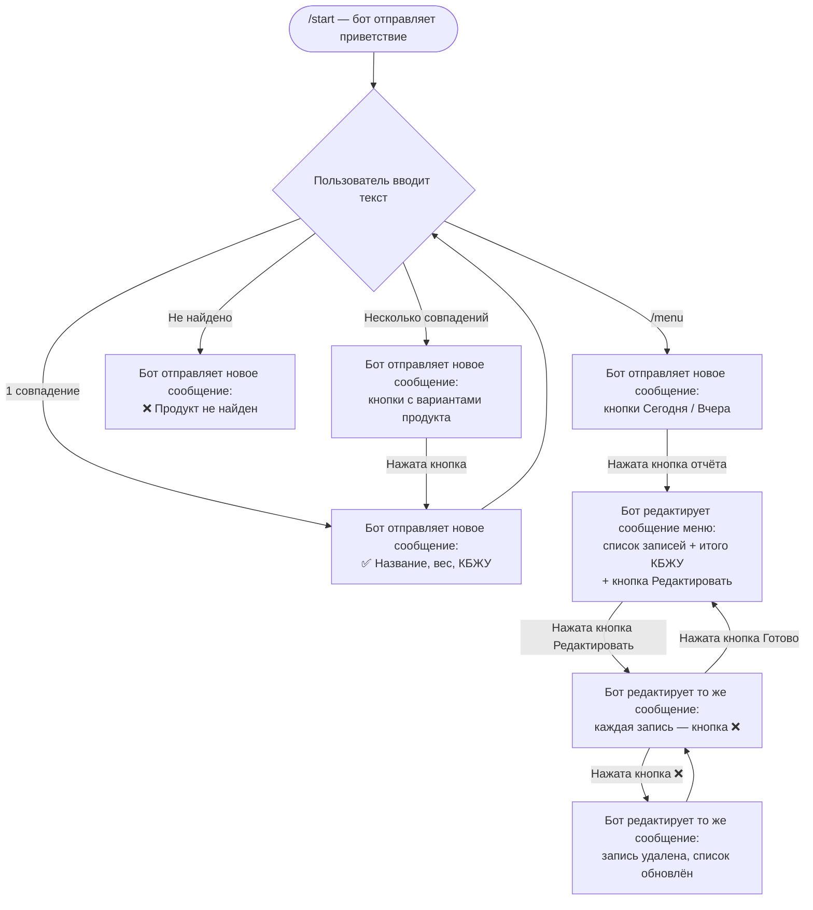

# Прототип интерфейса — Telegram-бот учёта питания

## Описание

Продукт — Telegram-бот для ведения дневника питания. Интерфейс полностью текстово-кнопочный, без веб-страниц. Ниже представлены wireframe-схемы ключевых экранов в виде Mermaid-диаграмм.

---

## Экран 1 — Приветствие (/start)

```
┌─────────────────────────────────────────┐
│  🤖 FoodBot                             │
├─────────────────────────────────────────┤
│                                         │
│  Привет! Я помогу отслеживать           │
│  калории и БЖУ.                         │
│                                         │
│  Просто напиши название еды и вес:      │
│  "Куриная грудка 150"                   │
│                                         │
│  Команды:                               │
│  /menu — открыть меню                   │
│                                         │
└─────────────────────────────────────────┘
```

---

## Экран 2 — Главное меню (/menu)

```
┌─────────────────────────────────────────┐
│  🤖 FoodBot                             │
├─────────────────────────────────────────┤
│                                         │
│  Выберите действие:                     │
│                                         │
│  ┌──────────────────────────────────┐   │
│  │  📊 Отчёт за сегодня             │   │
│  └──────────────────────────────────┘   │
│  ┌──────────────────────────────────┐   │
│  │  📅 Отчёт за вчера               │   │
│  └──────────────────────────────────┘   │
│                                         │
└─────────────────────────────────────────┘
```

---

## Экран 3 — Добавление продукта (1 совпадение)

```
┌─────────────────────────────────────────┐
│  Пользователь: "Гречка 200"             │
├─────────────────────────────────────────┤
│  🤖 FoodBot                             │
│                                         │
│  ✅ Сохранено: Гречка, 200г             │
│  🔥 Калории: 272 ккал                   │
│  🥩 Белки: 21.4г                        │
│  🫒 Жиры: 4.6г                          │
│  🌾 Углеводы: 78.2г                     │
│                                         │
└─────────────────────────────────────────┘
```

---

## Экран 4 — Выбор из нескольких совпадений

```
┌─────────────────────────────────────────┐
│  Пользователь: "Творог 100"             │
├─────────────────────────────────────────┤
│  🤖 FoodBot                             │
│                                         │
│  Найдено несколько вариантов.           │
│  Выберите нужный:                       │
│                                         │
│  ┌────────────┐ ┌────────────┐          │
│  │ Творог 2%  │ │ Творог 5%  │          │
│  └────────────┘ └────────────┘          │
│  ┌────────────┐                         │
│  │ Творог 9%  │                         │
│  └────────────┘                         │
│                                         │
└─────────────────────────────────────────┘
```

---

## Экран 5 — Дневной отчёт

```
┌─────────────────────────────────────────┐
│  🤖 FoodBot — Отчёт за сегодня          │
├─────────────────────────────────────────┤
│                                         │
│  📋 Записи:                             │
│  • Овсянка 100г — 88 ккал               │
│  • Куриная грудка 150г — 165 ккал       │
│  • Гречка 200г — 272 ккал               │
│                                         │
│  ─────────────────────────────          │
│  🔥 Итого: 525 ккал                     │
│  🥩 Белки: 62.3г                        │
│  🫒 Жиры: 8.1г                          │
│  🌾 Углеводы: 118.4г                    │
│                                         │
│  ┌──────────────────────────────────┐   │
│  │  ✏️ Редактировать                │   │
│  └──────────────────────────────────┘   │
│                                         │
└─────────────────────────────────────────┘
```

---

## Экран 6 — Режим редактирования

```
┌─────────────────────────────────────────┐
│  🤖 FoodBot — Редактирование            │
├─────────────────────────────────────────┤
│                                         │
│  Нажмите на запись, чтобы удалить её:   │
│                                         │
│  ┌──────────────────────────────────┐   │
│  │  ❌ Овсянка 100г                 │   │
│  └──────────────────────────────────┘   │
│  ┌──────────────────────────────────┐   │
│  │  ❌ Куриная грудка 150г          │   │
│  └──────────────────────────────────┘   │
│  ┌──────────────────────────────────┐   │
│  │  ❌ Гречка 200г                  │   │
│  └──────────────────────────────────┘   │
│  ┌──────────────────────────────────┐   │
│  │  ✅ Готово                       │   │
│  └──────────────────────────────────┘   │
│                                         │
└─────────────────────────────────────────┘
```

---

## Навигационный поток (Mermaid)

> Всё происходит в одном Telegram-чате. Нет переходов между экранами —
> бот либо отправляет новое сообщение, либо редактирует существующее (Edit Message).



---

## Комментарии к сообщениям бота

### Сценарий 1 — Добавление еды

| Действие пользователя | Реакция бота | Тип сообщения |
|---|---|---|
| `/start` | Приветствие + инструкция | Новое сообщение |
| Текст с весом, 1 совпадение | Подтверждение с КБЖУ порции | Новое сообщение |
| Текст с весом, несколько совпадений | Кнопки с вариантами продукта | Новое сообщение |
| Нажатие кнопки выбора | Подтверждение с КБЖУ порции | Редактирование предыдущего |
| Продукт не найден | Сообщение об ошибке | Новое сообщение |

### Сценарий 2 — Отчёт и редактирование

| Действие пользователя | Реакция бота | Тип сообщения |
|---|---|---|
| `/menu` | Кнопки "Сегодня" / "Вчера" | Новое сообщение |
| Кнопка "Сегодня" или "Вчера" | Список записей + итого КБЖУ | Редактирование сообщения меню |
| Кнопка "Редактировать" | Те же записи, каждая с кнопкой ❌ | Редактирование того же сообщения |
| Кнопка ❌ у записи | Запись удалена, список обновлён | Редактирование того же сообщения |
| Кнопка "Готово" | Финальный отчёт без кнопок удаления | Редактирование того же сообщения |
